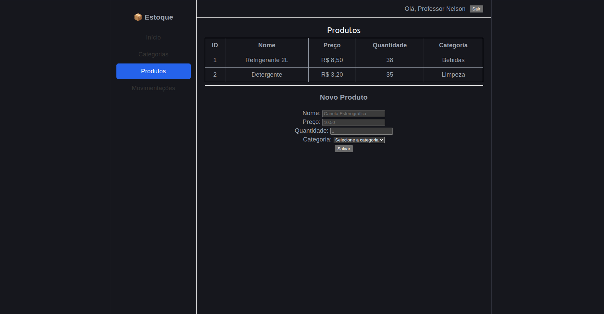
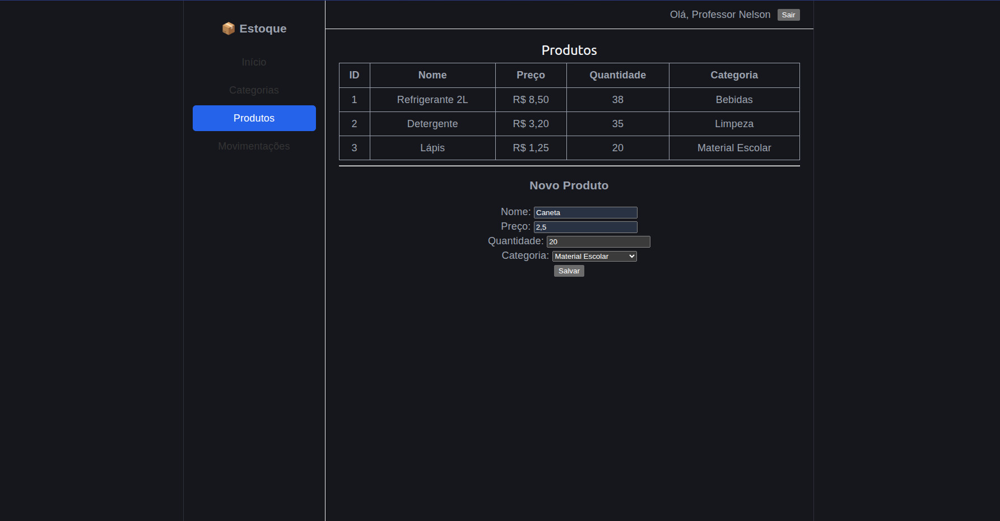
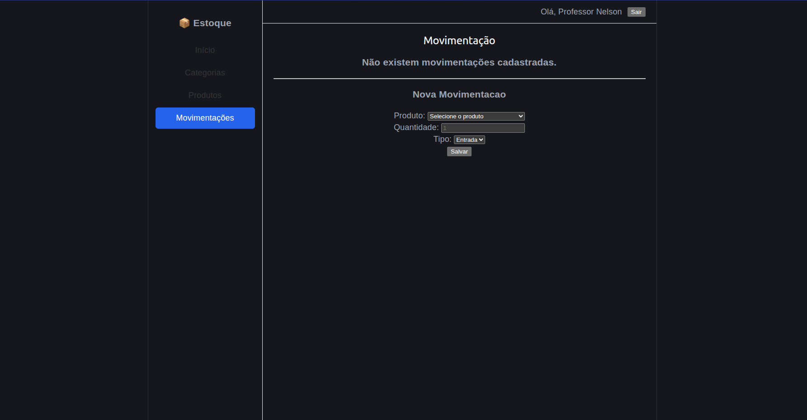
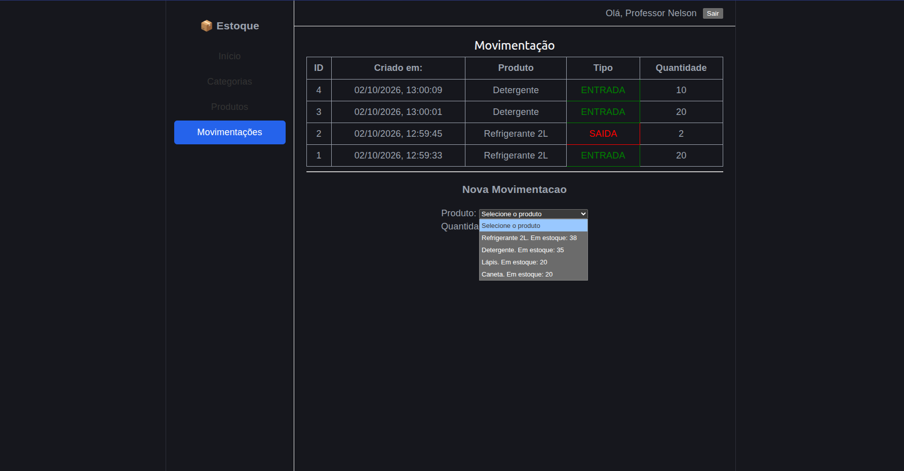
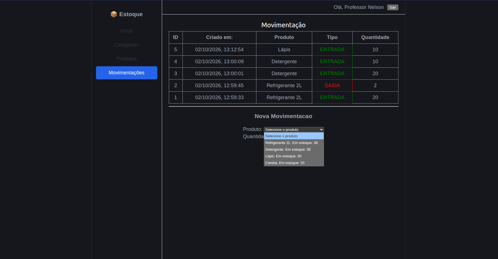

# Alterações realizadas no projeto

## Tela Produtos
Página no inicio:

Com um produto adicionado:

## Tela Movimentações
Página no ínicio:

Adicionando uma movimentação:

Pós registrada a movimentação:
